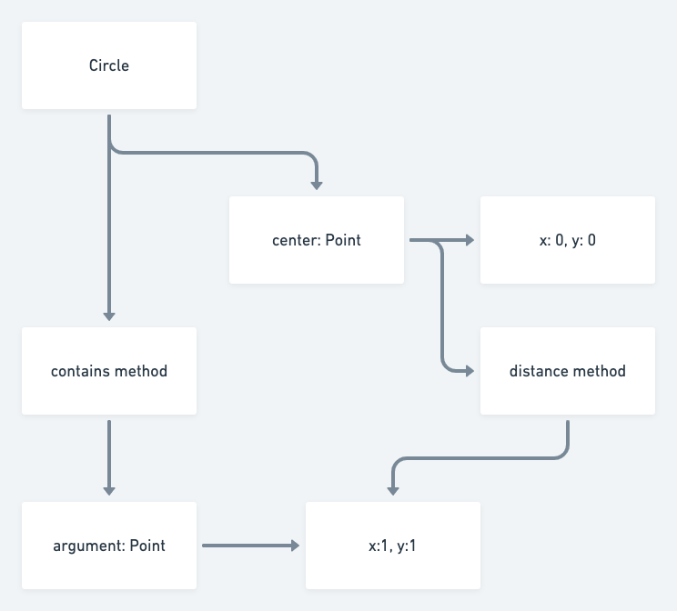

# Lecture 2

## Testability in OOP

- How testable is the program for others?

- Abstraction barrier

  - Barrier between the implementer and the client

## Writing tests

```java
// Bad example
Point p = new Point(1,2)
p.setX(5);
p.getX() == 5.0;
p.setX(10);
p.getX() == 10.0;
```

- Makes less sense as getX returns 2 different values
- Better way to unit test is to return this in setX
  - So that you can method chain

```java
new Point(1,2).setX(5).getX() == 5.0;
```

- To write reliable tests
  - Once Object is instantiated, Object should be immutable
  - To do so return a new Object rather than this

```java
// Bad
Point p = new Point(1,2);
p.incX(0.5).getX() == 1.5;
p.incX(0.5).getX() == 2.0;
p.incX(0.5).getX() == 2.5;
```

```java
// Good
Point p = new Point(1,2);
p.incX(0.5).getX() == 1.5;
p.incX(0.5).getX() == 1.5;
p.incX(0.5).getX() == 1.5;
```

## Inheritance

```java
new Point(1,3)
$10 ==> Point@5c29bfd
```

- Why is the address value return when you creat a new point?
  - Point is inherited from default Object
  - toString method of default Object gives the address value
- To override use the `@Override` annotation

  - lets compiler knows that method is used to override parent class

- Mental model



_Random quote_
"While CS2040 trains you to be efficient, CS2030 trains you to be human."

## Bottom-up testing

- Test bottom first as bottom has no dependencies
- Go upwards once bottom passes
- i.e.
  - Start with Point first then Circle

## Cyclic dependency

- Unit Circle -> Circle -> Point -> Unit Circle
- Avoid cyclic dependencies
  - e.g. testing class A requires class B to be tested first, & vice versa
- Problem 
  - Book <-> Student
- Solution: Use an association class to break the cyclic dependency
  - Book <- Loan -> Student


* inheritance
  - every object inherits from from the object class
  - to override
    - have to override the method
* @Override notation
  - Tells compiler that is overriding the base object

```java
// Returns overrides class to String method
@Override
public String toString() {
  return 'x';
}
```

```java
public class Circle {
  private final Point centre;
  private final double radius;


  public Circle(Point centre, double radius) {
    this.radius = radius;
    this.centre = centre;
  }

  static Circle createCircle(Point point, double point) {
    if (radius > 0) {
      return new Point(point, radius);
    } else {
      return null;
    }
  }

  public boolean contains(Point point) {
    return centre.distanceTo(point) < radius + 1E-15;
  }

  @Override
  public String toString() {
    return "Circle centered at " + this.centre + " with radius " + radius;
  }
}
```

- Object oriented mental model

  - Establish mental model that is correct, consistent & complete

- factory methods
  - Check your constraints
